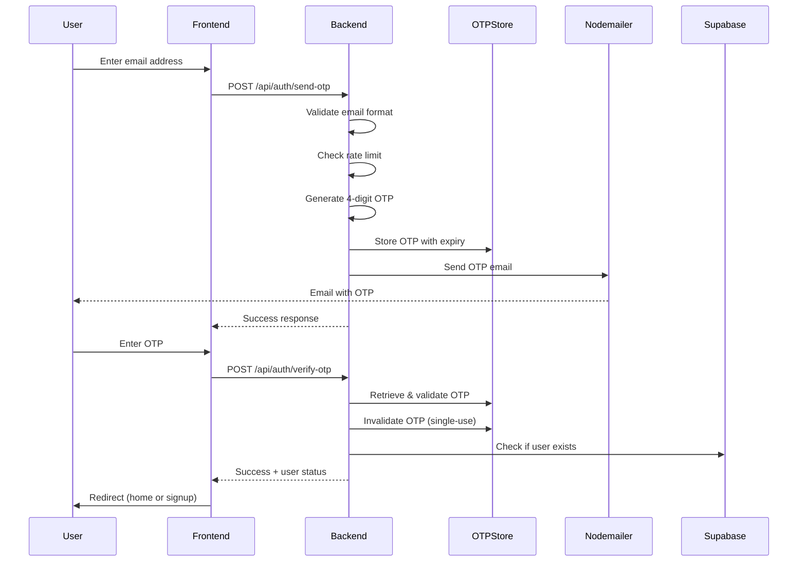

# Design Document: Email OTP Verification

## Overview

This design implements a secure email-based OTP verification system for the Spoon canteen application. The system replaces the current client-side simulated OTP with real server-side OTP generation, email delivery via Nodemailer, and secure verification.

The architecture follows a stateless approach using in-memory storage for OTP sessions (suitable for single-server MVP), with the existing Nodemailer infrastructure already configured for order notifications.

## Architecture



## Components and Interfaces

### 1. OTP Routes (`backend/routes/auth.js`)

New Express router handling authentication endpoints.

```javascript
// POST /api/auth/send-otp
// Request: { email: string }
// Response: { success: boolean, message: string }

// POST /api/auth/verify-otp
// Request: { email: string, otp: string }
// Response: { success: boolean, isNewUser: boolean, user?: object }
```

### 2. OTP Store (`backend/services/otpStore.js`)

In-memory store for OTP sessions with automatic cleanup.

```javascript
interface OTPSession {
  otp: string;           // 4-digit code
  email: string;         // User email
  expiresAt: number;     // Unix timestamp
  attempts: number;      // Verification attempts
}

interface RateLimitEntry {
  count: number;         // Request count
  windowStart: number;   // Window start timestamp
}

// Methods
generateOTP(email: string): string
verifyOTP(email: string, otp: string): { valid: boolean, error?: string }
checkRateLimit(email: string): { allowed: boolean, retryAfter?: number }
```

### 3. Email Service (`backend/services/emailService.js`)

Reusable email service wrapping Nodemailer (extends existing order email functionality).

```javascript
// Method
sendOTPEmail(email: string, otp: string): Promise<{ success: boolean, error?: string }>
```

### 4. Frontend Updates

**login.html / login.js**:
- Change from phone input to email input
- Call backend `/api/auth/send-otp` on form submit
- Handle loading states and errors

**otp.html / otp.js**:
- Update to work with email instead of phone
- Call backend `/api/auth/verify-otp` on OTP submit
- Handle verification responses and errors

**signup.html / signup.js**:
- Receive verified email from URL params
- Remove phone number field (email is now primary identifier)
- Update user creation to use email as identifier

## Data Models

### OTP Session (In-Memory)

```javascript
{
  email: "user@example.com",
  otp: "1234",
  expiresAt: 1704067200000,  // 5 minutes from creation
  attempts: 0,               // Max 5 attempts
  createdAt: 1704066900000
}
```

### Rate Limit Entry (In-Memory)

```javascript
{
  email: "user@example.com",
  count: 3,                  // Requests in current window
  windowStart: 1704066000000 // 15-minute window start
}
```

### User Record (Supabase - existing `users` table or localStorage for MVP)

```javascript
{
  email: "user@example.com",  // Primary identifier (changed from phone)
  name: "John Doe",
  phone: "9876543210",        // Optional, for order notifications
  createdAt: "2024-01-01T00:00:00Z"
}
```


## Correctness Properties

*A property is a characteristic or behavior that should hold true across all valid executions of a system—essentially, a formal statement about what the system should do. Properties serve as the bridge between human-readable specifications and machine-verifiable correctness guarantees.*

### Property 1: OTP Format Invariant
*For any* valid email address, when an OTP is generated, the result SHALL be a string of exactly 4 numeric digits (0-9).
**Validates: Requirements 1.1**

### Property 2: OTP Generation Uniqueness
*For any* sequence of OTP generations, the probability of generating the same OTP consecutively SHALL be less than 0.01% (1 in 10,000).
**Validates: Requirements 1.2**

### Property 3: OTP Storage Round-Trip
*For any* valid email address, generating an OTP and then verifying with that same OTP (before expiration) SHALL return success.
**Validates: Requirements 1.3, 3.1, 3.2**

### Property 4: OTP Replacement Invalidation
*For any* email address, when a new OTP is generated while a previous one exists, verifying with the old OTP SHALL fail.
**Validates: Requirements 1.4**

### Property 5: Email Content Contains OTP
*For any* 4-digit OTP string, the generated email body SHALL contain that exact OTP string.
**Validates: Requirements 2.2**

### Property 6: Wrong OTP Rejection
*For any* email with a stored OTP, submitting any OTP that differs from the stored value SHALL return an invalid OTP error.
**Validates: Requirements 3.3**

### Property 7: Single-Use Enforcement
*For any* successfully verified OTP, attempting to verify with the same OTP again SHALL fail.
**Validates: Requirements 3.5**

### Property 8: Rate Limit Enforcement
*For any* email address, after 5 OTP requests within a 15-minute window, the 6th request SHALL be rejected with a rate limit error.
**Validates: Requirements 4.1, 4.2**

### Property 9: Verification Attempt Limit
*For any* OTP session, after 5 failed verification attempts, further verification attempts SHALL be blocked until a new OTP is generated.
**Validates: Requirements 4.3**

### Property 10: Invalid Email Rejection
*For any* string that is not a valid email format, requesting an OTP SHALL return a validation error and no OTP SHALL be stored.
**Validates: Requirements 5.1, 5.2**

## Error Handling

### API Error Responses

All error responses follow a consistent format:

```javascript
{
  success: false,
  error: {
    code: "ERROR_CODE",
    message: "Human-readable message"
  }
}
```

### Error Codes

| Code | HTTP Status | Description |
|------|-------------|-------------|
| `INVALID_EMAIL` | 400 | Email format validation failed |
| `RATE_LIMITED` | 429 | Too many OTP requests |
| `EMAIL_SEND_FAILED` | 500 | Nodemailer failed to send email |
| `INVALID_OTP` | 400 | OTP does not match |
| `OTP_EXPIRED` | 400 | OTP has expired (5 min) |
| `OTP_NOT_FOUND` | 400 | No OTP exists for this email |
| `MAX_ATTEMPTS` | 400 | Too many verification attempts |

### Error Handling Strategy

1. **Validation Errors**: Return immediately with specific error code
2. **Rate Limit Errors**: Include `retryAfter` timestamp in response
3. **Email Failures**: Log error, return generic failure to client
4. **Expired OTP**: Clean up expired entry, return expiration error
5. **Server Errors**: Log full error, return generic 500 response

## Testing Strategy

### Unit Tests

Unit tests verify specific examples and edge cases:

1. **OTP Generation**
   - Generates 4-digit string
   - Different emails get different OTPs (most of the time)

2. **Email Validation**
   - Valid emails: `user@example.com`, `test.user@domain.co.uk`
   - Invalid emails: `invalid`, `@domain.com`, `user@`, `user@.com`

3. **Rate Limiting**
   - First 5 requests succeed
   - 6th request fails with rate limit error
   - Rate limit resets after window expires

4. **OTP Verification**
   - Correct OTP succeeds
   - Wrong OTP fails
   - Expired OTP fails
   - Already-used OTP fails

### Property-Based Tests

Property-based tests use fast-check library to verify universal properties across many generated inputs. Each test runs minimum 100 iterations.

**Test Configuration:**
- Library: fast-check (JavaScript PBT library)
- Iterations: 100 per property
- Tag format: `Feature: email-otp-verification, Property N: {property_text}`

**Properties to Test:**
1. OTP Format Invariant (Property 1)
2. OTP Storage Round-Trip (Property 3)
3. OTP Replacement Invalidation (Property 4)
4. Email Content Contains OTP (Property 5)
5. Wrong OTP Rejection (Property 6)
6. Single-Use Enforcement (Property 7)
7. Rate Limit Enforcement (Property 8)
8. Invalid Email Rejection (Property 10)

### Integration Tests

1. **Full OTP Flow**: Request OTP → Receive email → Verify OTP
2. **New User Flow**: Verify OTP → Redirect to signup
3. **Existing User Flow**: Verify OTP → Redirect to home
4. **Error Scenarios**: Invalid email, wrong OTP, expired OTP
