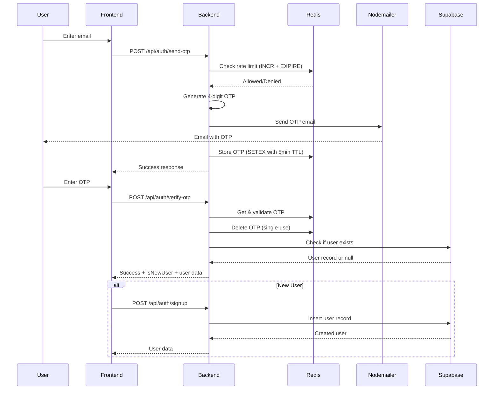

# Design Document: OTP Scaling for Production

## Overview

This design upgrades the email OTP verification system from MVP (in-memory storage) to production-ready infrastructure capable of handling 500 concurrent users. The key changes are:

1. **Redis** for OTP sessions and rate limiting (persistent, fast, auto-expiring)
2. **Supabase** for user persistence (permanent user records)
3. **Graceful degradation** with proper error handling
4. **Health checks** for monitoring service availability

The existing API contracts remain unchanged - this is a backend infrastructure upgrade.

## Architecture



## Components and Interfaces

### 1. Redis OTP Store (`backend/services/redisOtpStore.js`)

Replaces in-memory Maps with Redis commands.

```javascript
// Redis Key Patterns:
// OTP Session: otp:{email} -> JSON { otp, attempts, createdAt }
// Rate Limit:  rate:{email} -> count (integer)

// Methods (same interface as otpStore.js)
async generateOTP(email): string
async storeOTP(email, otp): void
async verifyOTP(email, otp): { valid: boolean, error?: string }
async checkRateLimit(email): { allowed: boolean, retryAfter?: number }
```

### 2. Redis Client (`backend/services/redisClient.js`)

Singleton Redis connection with reconnection logic.

```javascript
// Configuration from environment
REDIS_URL=redis://localhost:6379

// Methods
getClient(): Redis
isConnected(): boolean
disconnect(): Promise<void>
```

### 3. User Service (`backend/services/userService.js`)

Manages user records in Supabase.

```javascript
// Methods
async createUser(email, name): { user: object, error?: string }
async getUserByEmail(email): { user: object | null, error?: string }
async userExists(email): boolean
```

### 4. Updated Auth Routes (`backend/routes/auth.js`)

Updated to use Redis store and integrate with user service.

```javascript
// POST /api/auth/send-otp - unchanged API
// POST /api/auth/verify-otp - now returns user data if exists
// POST /api/auth/signup - NEW endpoint for user creation
```

### 5. Health Check Endpoint (`backend/routes/health.js`)

```javascript
// GET /api/health
// Response: { status: "healthy" | "degraded" | "unhealthy", services: {...} }
```

## Data Models

### Redis OTP Session

```javascript
// Key: otp:{email}
// TTL: 300 seconds (5 minutes)
{
  "otp": "1234",
  "attempts": 0,
  "createdAt": 1704067200000
}
```

### Redis Rate Limit

```javascript
// Key: rate:{email}
// TTL: 900 seconds (15 minutes)
// Value: integer count (1-5)
```

### Supabase Users Table

```sql
CREATE TABLE users (
  email TEXT PRIMARY KEY,
  name TEXT NOT NULL,
  created_at TIMESTAMPTZ DEFAULT NOW(),
  updated_at TIMESTAMPTZ DEFAULT NOW()
);

-- Index for faster lookups
CREATE INDEX idx_users_email ON users(email);
```

## Correctness Properties

*A property is a characteristic or behavior that should hold true across all valid executions of a system—essentially, a formal statement about what the system should do. Properties serve as the bridge between human-readable specifications and machine-verifiable correctness guarantees.*

### Property 1: Redis OTP Storage Round-Trip
*For any* valid email address, generating an OTP, storing it in Redis, and then verifying with that same OTP (before expiration) SHALL return success.
**Validates: Requirements 1.1, 3.1, 3.2 (from original spec)**

### Property 2: Rate Limit Enforcement with Retry-After
*For any* email address, after 5 OTP requests within a 15-minute window, the 6th request SHALL be rejected with a rate limit error containing a positive retry-after value in seconds.
**Validates: Requirements 2.2, 2.4**

### Property 3: User Creation with Required Fields
*For any* valid email and name, creating a user SHALL result in a record containing email, name, created_at, and updated_at fields, and the email SHALL be unique (duplicate creation fails).
**Validates: Requirements 3.1, 3.3, 3.5**

### Property 4: User Lookup Round-Trip
*For any* user that has been created, looking up by email SHALL return the same user data that was stored.
**Validates: Requirements 3.2**

### Property 5: Email Failure Prevents OTP Storage
*For any* OTP generation request where email sending fails, the OTP SHALL NOT be stored in Redis (no orphaned OTPs).
**Validates: Requirements 4.3**

## Error Handling

### Error Codes (Extended)

| Code | HTTP Status | Description |
|------|-------------|-------------|
| `INVALID_EMAIL` | 400 | Email format validation failed |
| `RATE_LIMITED` | 429 | Too many OTP requests |
| `EMAIL_SEND_FAILED` | 500 | Nodemailer failed to send email |
| `INVALID_OTP` | 400 | OTP does not match |
| `OTP_EXPIRED` | 400 | OTP has expired (5 min) |
| `OTP_NOT_FOUND` | 400 | No OTP exists for this email |
| `MAX_ATTEMPTS` | 400 | Too many verification attempts |
| `SERVICE_UNAVAILABLE` | 503 | Redis or Supabase unavailable |
| `USER_EXISTS` | 409 | Email already registered |
| `USER_NOT_FOUND` | 404 | User doesn't exist |

### Service Unavailability Handling

```javascript
// Redis unavailable
if (!redisClient.isConnected()) {
  return res.status(503).json({
    success: false,
    error: {
      code: 'SERVICE_UNAVAILABLE',
      message: 'Service temporarily unavailable. Please try again in a few moments.'
    }
  });
}
```

## Testing Strategy

### Unit Tests

1. **Redis OTP Store**
   - Store and retrieve OTP
   - Verify TTL is set correctly
   - Handle Redis errors gracefully

2. **User Service**
   - Create user with valid data
   - Lookup existing user
   - Handle duplicate email
   - Handle Supabase errors

3. **Health Check**
   - Returns healthy when all services up
   - Returns degraded/unhealthy when services down

### Property-Based Tests

Property-based tests use fast-check library. Each test runs minimum 100 iterations.

**Test Configuration:**
- Library: fast-check
- Iterations: 100 per property
- Tag format: `Feature: otp-scaling-production, Property N: {property_text}`

**Properties to Test:**
1. Redis OTP Storage Round-Trip (Property 1)
2. Rate Limit Enforcement with Retry-After (Property 2)
3. User Creation with Required Fields (Property 3)
4. User Lookup Round-Trip (Property 4)
5. Email Failure Prevents OTP Storage (Property 5)

### Integration Tests

1. **Full Flow with Redis**: Send OTP → Store in Redis → Verify → Check persistence
2. **User Registration Flow**: Verify OTP → Create user in Supabase → Login returns user
3. **Service Failure Scenarios**: Redis down, Supabase down, Email failure

## Environment Configuration

```bash
# Redis Configuration
REDIS_URL=redis://localhost:6379
REDIS_PASSWORD=optional_password

# Supabase (existing)
SUPABASE_URL=https://your-project.supabase.co
SUPABASE_ANON_KEY=your_anon_key
SUPABASE_SERVICE_ROLE_KEY=your_service_role_key

# SMTP (existing)
SMTP_EMAIL=your_email@gmail.com
SMTP_PASSWORD=your_app_password
```

## Migration Notes

1. **No breaking changes** - API contracts remain the same
2. **Fallback option** - Can keep in-memory store as fallback if Redis unavailable (optional)
3. **Data migration** - No existing data to migrate (MVP used localStorage)
4. **Deployment order**: 
   - Deploy Redis instance first
   - Run Supabase migration to create users table
   - Deploy updated backend code
